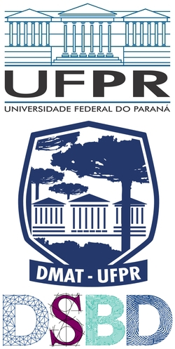

# 

  
  
  
  

---

  

## Assistant Professor <small>at the Federal University of Paraná, Mathematics Department</small>

I teach around 5 courses a year, usually in the topics of multivariate calculus, numerical methods, numerical linear algebra and optimization.

I also work in the [Data Science & Big Data specialization](https://dsbd.leg.ufpr.br), where I teach optimization and machine learning.

My research focus is on optimization and machine learning, lately focused on implementing a framework for nonlinear optimization called JuliaSmoothOptimizers. I am also co-creator of the group CiDAMO. Both are explained in more details below.

---

  

## [JuliaSmoothOptimizers](https://github.com/JuliaSmoothOptimizers)

I am lead developer of packages inside the JuliaSmoothOptimizers organization. These packages are focused on the development of optimization methods for nonlinear optimization.

Some of our main packages:

- [**NLPModels.jl**](https://github.com/JuliaSmoothOptimizers/NLPModels.jl): Defines an optimization model and the API to access the problem. The following packages implement this:
[AmplNLReader.jl](https://github.com/JuliaSmoothOptimizers/)
[CUTEst.jl](https://github.com/JuliaSmoothOptimizers/CUTEst.jl),
[NLPModelsJuMP.jl](https://github.com/JuliaSmoothOptimizers/NLPModelsJuMP.jl).
- [**Krylov.jl**](https://github.com/JuliaSmoothOptimizers/Krylov.jl): Implement Krylov methods for linear systems and least-squares problems. Uses [LinearOperators.jl](https://github.com/JuliaSmoothOptimizers/LinearOperators.jl) to deal with matrices.
- [**CaNNOLeS.jl**](https://github.com/JuliaSmoothOptimizers/CaNNOLeS.jl), [**JSOSolvers.jl**](https://github.com/JuliaSmoothOptimizers/JSOSolvers.jl),  [**NLPModelsIpopt.jl**](https://github.com/JuliaSmoothOptimizers/NLPModelsIpopt.jl), [**NLPModelsKnitro.jl**](https://github.com/JuliaSmoothOptimizers/NLPModelsKnitro.jl), [**Percival.jl**](https://github.com/JuliaSmoothOptimizers/Percival.jl): Our nonlinear optimization solvers and wrappers.

---

  

## [CiDAMO](https://cidamo.com.br)

I am co-founder of CiDAMO, a Data Science, Machine Learning, and Optimization study and research group inside the Federal University of Paraná in Brazil.

We advise students and stimulate discussions about these topics weekly. We have monthly meetups (online) with guest speakers. Check the [website](https://cidamo.com.br) for more information.

We have also created one of the first data science events on the university, with 8 companies and several participants, called [CiDWeek](https://cidamo.com.br/CiDWeek/), early 2020.

---

## [JILL](https://github.com/abelsiqueira/jill) - Julia Installer 4 Linux (Light)

A simple script to install Linux and MacOS using the latest binaries on the page.

---

## [Perprof-py](https://github.com/ufpr-opt/perprof-py)

A Python module for performance profiling (as described by Dolan and Moré) with TikZ and matplotlib output.

There is a paper related to this project:

    Siqueira, A. S., Costa da Silva, R. G. and Santos, L.-R., (2016). Perprof-py: A Python Package for Performance Profile of Mathematical Optimization Software. Journal of Open Research Software. 4(1), p.e12. DOI: http://doi.org/10.5334/jors.81.
